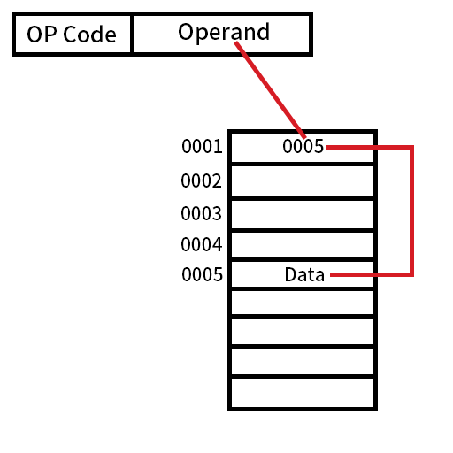

# 주소

## Operand의 Address 수에 따른 분류
명령어에서 주소가 몇개 오느냐에 따라 0-주소 부터 3-주소로 나뉩니다.

### 0-주소 명령어
| OP Code |
|-----|

OP Code만 존재합니다.

주로 Stack 구조 컴퓨터에서 사용하며 입출력 자료 저장 대상이 고정되있습니다.

### 1-주소 명령어
| OP Code | Address1 |
|-----|-----|

Address부분이 하나입니다.

Address가 가르키는 데이터와 누산기하고 연산합니다.

### 2-주소 명령어
| OP Code | Address1 | Address2 |
|-----|-----|-----|

Address부분이 두개입니다.

범용 레지스터 구조의 컴퓨터에서 많이 사용됩니다.

Address1과 Address2의 연산 결과가 Address1에 다시 저장됩니다.

### 3-주소 명령어
| OP Code | Address1 | Address2 | Address3 |
|-----|-----|-----|-----|

Address부분이 세개입니다. Address1에 나머지 두 주소 연산 결과를 저장합니다.

## 주소 지정 방식
연산할 데이터를 가져오는 방법에 따라 나뉩니다.

### 묵시(암시)적 주소 지정
| OP Code |
|-----|

연산 대상이 주로 누산기입니다. 0-주소 방식을 가지고 있습니다.

### 즉시 주소 지정
| OP Code | Data |
|-----|-----|

Operand에 **실제 데이터**가 넘어옵니다.

### 직접 주소 지정
| OP Code | Address |
|-----|-----|

Operand에 **실제 데이터가 저장된 주소**가 넘어옵니다.

### 간접 주소 지정
| OP Code | Address |
|-----|-----|

Operand에 **실제 데이터가 저장된 주소의 주소**가 넘어옵니다.

이 경우 짧은 길이로 긴 주소에 접근 할 수 있습니다.

### Register 주소 지정
| OP Code | REG |
|-----|-----|

Register의 값을 (주로) 누산기 대상으로 연산합니다.

### Register 간접 주소 지정
| OP Code | REG |
|-----|-----|

Register가 가르키는 주소에 있는 데이터가 (주로) 누산기 대상으로 연산합니다.

### 상대 주소 지정
| OP Code | 변위 |
|-----|-----|

Program Counter에 변위를 더하여 주소를 결정합니다.

### 베이스 Register 주소 지정
| OP Code | 변위 |
|-----|-----|

베이스 Register에 변위를 더하여 주소를 결정합니다.

### 인덱스 주소 지정
| OP Code | 변위 |
|-----|-----|

인덱스 Register에 변위를 더하여 주소를 결정합니다.